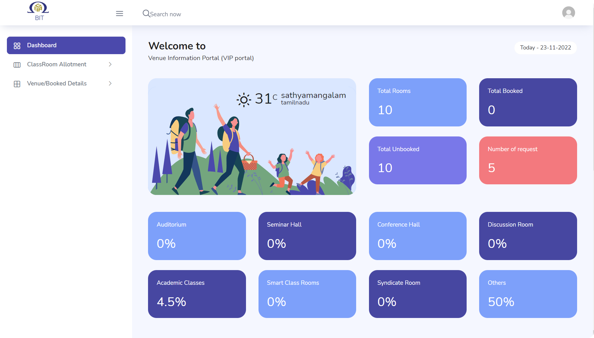

# Classroom Reservation System

In our institute, managing and reserving classrooms for academics and various functions has traditionally been a time-consuming process, involving phone calls and manual effort. This often results in 50% of classrooms being constantly occupied while the remaining 40% remain empty. Such inefficiencies not only waste the faculty's and students' time but also disrupt the scheduling of classes and events. To address these challenges, we have developed a comprehensive Classroom Reservation System.

## Introduction

Our application streamlines the process of reserving classrooms, preventing scheduling conflicts, and optimizing classroom usage. It consists of three key models: the User model, the Admin model, and the Communication model. Let's explore how our system can benefit both faculty and students.

## Key Features

### 1. Easy Reservation

Faculty and student organizers can use our application to request the assignment of specific rooms for events, additional classes, exhibitions, competitions, and more. Users can specify their requirements, including the room type, capacity, the number of systems, Wi-Fi availability, and projector requirements.

->

->

### 2. User-Friendly Interface

Our user interface is designed to be intuitive, ensuring that users can easily navigate the website and understand how it works. Users have the flexibility to edit or delete previously submitted requests, with updates reflected directly in the database.

### 3. Conflict Prevention

Our system eliminates conflicts by allocating rooms in advance. It shows available rooms to the administrator based on user preferences. The administrator can then choose a suitable room from the list of options. This ensures that there are no scheduling conflicts for academics and extracurricular activities.

### 4. Notification System

Our application features a notification system that sends emails to the administrator whenever a user submits a request. This streamlines the approval process, and once a request is approved, the user receives a confirmation email for their records.

### 5. Usage Analytics

One of the additional benefits of our application is its ability to provide insights into room usage. It displays how much time each classroom, auditorium, and seminar hall is used. This information includes the proportion and total number of hours each room was used each month. This data helps the scheduling team optimize room allocation and infrastructure planning.

### 6. Time and Stress Savings

In summary, our web application is designed to save users time and reduce the stress associated with reserving classrooms. It simplifies the entire process, from requesting rooms to approval and usage analytics.

By utilizing our system, faculty and students can focus on their academic activities and events without the hassle of manual room booking. It also contributes to efficient infrastructure management by identifying idle classrooms that can be better utilized.

We invite you to explore our Classroom Reservation System and experience the benefits of a streamlined and efficient room reservation process.
